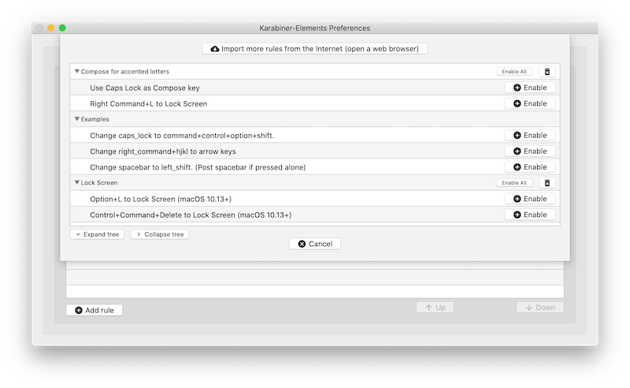

## Compose key on OS X

Adapted from [viis/osx-compose-key](https://github.com/viis/osx-compose-key).

### What is a compose key?

A "compose" key is an input method used for complex characters.  It allows you to press your compose key (I bind mine to Caps Lock on my mac keyboard), and then type something, for instance:

* `[Compose]`, `a`, `` ` `` = `à`
* `[Compose]`, `e`, `'` = `é`
* `[Compose]`, `a`, `e` = `æ`
* `[Compose]`, `"`, `o` = `ö`

### Compose key for multilingual typists

For those that type in multiple languages (that require non-english characters), the compose key can serve an
alternative to constantly switching keyboard layouts. The keybindings in this repository cover at least the following
languages:

* Italian
* Nordic languages
* German
* Spanish
* Catalan

Feel free to submit pull requests for more characters.

### Setting up a "Compose Key" in Mac OS X

#### Automatic installation

Run the install.sh script included in this repo

#### Manual installation

Install [Karabiner Elements](https://karabiner-elements.pqrs.org/) for remapping keys support, and download these files into the correct places:

```bash
brew cask install karabiner-elements
mkdir -p ~/.config/karabiner/assets/complex_modifications
curl 'https://raw.githubusercontent.com/giallu/osx-compose-key/master/compose.json' -o ~/.config/karabiner/assets/complex_modifications/compose.json
mkdir -p ~/Library/KeyBindings
curl 'https://raw.githubusercontent.com/giallu/osx-compose-key/master/DefaultKeyBinding.dict' -o ~/Library/KeyBindings/DefaultKeyBinding.dict
```

In Karabiner, enable "Use Caps Lock as Compose Key":



Your Caps Lock is now a compose key.

Note: to apply changes to `~/Library/KeyBindings/DefaultKeyBinding.dict` please
logout and then login again
